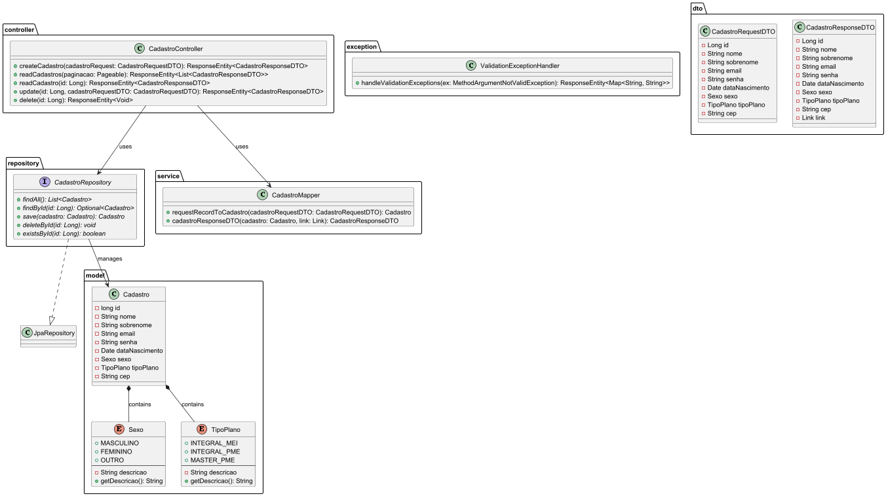
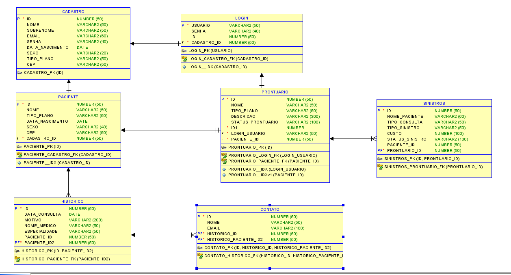

# DentalSin

## Autores

**João Pedro Fontana Villagra | RM553343**  
Idealização do projeto Java, criação de grande parte do código fonte.

**Vinicius Malavia Lorenzetti | RM 553121**  
Criação dos métodos PUT e DELETE e auxílio com a ideia principal do Challenge.

## Período de Desenvolvimento

Aplicação desenvolvida entre **02/09/2024** e **08/11/2024**.

## Sprints

### 1º Sprint (02/09 a 07/10)
- **27/09**: Criação do projeto **SpringBoot**, diretórios, classes e repositórios.
- **27/09**: Adição dos métodos **Post**, **Get** e **GetById**.
- **28/09**: Criação do **README**.
- **07/10**: Inserção dos endpoints e instruções de como rodar a aplicação.

### 2º Sprint (08/10 a 08/11)
- **17/10**: Implementação do **Lombok** na classe **Cadastro**.
- **18/10**: **@Operation** e **@ApiResponse** para auxílio nas requisições.
- **18/10**: Criação do link para **HATEOAS**.
- **22/10**: Atualização das validações.
- **23/10**: Criação dos **Enums** para **Sexo** e **TipoPlano**.
- **28/10**: Adição dos diagramas e renomeação.


## Link do Vídeo da Proposta Tecnológica

[Link do vídeo.](https://www.youtube.com/watch?v=yUlYOG-bqCk&ab_channel=Jo%C3%A3oPedro)

## Objetivo

O objetivo da aplicação é o usuário relatar os sintomas que está sentindo e, através de uma predição analítica, devolver um possível diagnóstico.

## Público-alvo

Quem seria esse possível usuário? Qualquer um que necessite de tratamento dentário. Claro que pode se estimar uma faixa etária de 15 a 60 anos. A explicação para isso é que o sistema é voltado para indivíduos que já possuem todos os dentes permanentes e estão mais suscetíveis a problemas dentários, além de que a triagem de casos atuaria tanto no começo de complicações odontológicas quanto com elas já em atuação.

## Descrição do Sistema

O sistema Java consiste em uma API para administração de cadastros. Através dela, todo cadastro realizado na plataforma seria mantido no banco de dados Oracle, além de possibilitar realizar o CRUD com os mesmos dados.

## Instruções para Rodar a Aplicação

O usuário apenas deve rodar a classe `JavaChallengeApplication`, visto que o banco de dados Oracle ja está criado e com as tabelas configuradas, e o usuário e senha é automaticamente passado na `application.properties`, não necessitando que o programa seja rodado com parâmetros.

[Vídeo explicativo.](https://www.youtube.com/watch?v=MIxtdDENVyA&ab_channel=Jo%C3%A3oPedro)

## Endpoints da API
### Parâmetros da API

| Parâmetro | Tipo | Descrição |
|-----------|------|:-----------:|
|`id`       |`int` | Id do cadastro no banco de dados Oracle.|
|`nome`     |`String`| Nome do usuário.|
|`sobrenome`|`String`| Sobrenome do usuário.|
|`email`    |`String`| Email do usuário.|
|`senha`    |`String`| Senha do usuário.|
|`dataNascimento`|`Date`| Data de nascimento do usuário (*yyyy-mm-dd*).|
|`sexo`     |`String`| Sexo do usuário.|
|`tipoPlano`|`String`| Tipo de plano da Odontoprev do usuário.|
|`cep`      |`String`| CEP do usuário.|
### 1. **Criar Cadastro** - `POST /cadastros`
   - Descrição: Cria um novo cadastro no sistema.
   - Corpo da Requisição:
     ```json
     {
       "id": 1,
       "nome": "João",
       "sobrenome": "Pedro",
       "email": "joao.pedro@gmail.com",
       "senha": "senhaSegura",
       "dataNascimento": "1995-05-20",
       "sexo": "M",
       "tipoPlano": "Premium",
       "cep": "08730-300"
     }
     ```
     
### 2. **Listar Cadastros** - `GET /cadastros`
   - Descrição: Retorna uma lista de cadastros.

### 3. **Consultar Cadastro por ID** - `GET /cadastros/{id}`
   - Descrição: Retorna um cadastro específico.

### 4. **Atualizar Cadastro** - `PUT /cadastros/{id}`
   - Descrição: Atualiza os dados de um cadastro.

### 5. **Deletar Cadastro** - `DELETE /cadastros/{id}`
   - Descrição: Deleta um cadastro do sistema.

## Diagrama de classe


## DER

